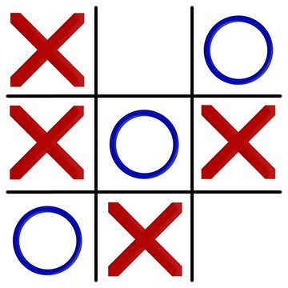

**Mon jeu de morpion**  
Le jeu de morpion consiste a aligner les croix vericalement, horizontalement et diagonalement.  
Le jeu ci-contre ce joue contre un bot qui a un tend de reflection de 1 seconde.  
Le jeu se termine que dans trois cas:  
- quand c'est le bot qui gagne
- quand c'est le joueur qui gagne
- ou quand le plateau est complet et que aucun de nous n'as gagné.

  

La partie qui m'as le plus posée problème c'est de passé le jeu qui etait sur la console sur le plateaux de pygame.   
Pour cela j'ai demander de l'aide a Gemini car Thonny ne voulais rien m'afficher sur le plateau.   
Je lui ai demadé de m'afficher l'image a gauche et le texte a droite mais apres j'ai eu un probleme de debordement.  
J'ai donc du lui demander de me regler se probleme.  

**Voici l'explication de mon code ligne par ligne:**  
1. Importation des bibliothèques  
import random  
import pygame  
import sys  

*random : Utilisé pour générer des coups aléatoires pour le bot.  
pygame : Bibliothèque pour créer des jeux en Python (gestion des fenêtres, graphismes, événements, etc.).  
sys : Permet de quitter proprement le programme avec sys.exit().  *

2. Initialisation de Pygame  

pygame.init()  

Initialise tous les modules de Pygame.  

3. Paramètres de la fenêtre  

largeur_fenetre = 1000  
hauteur_fenetre = 600  
largeur_jeu = 600  
hauteur_jeu = 600  
screen = pygame.display.set_mode((largeur_fenetre, hauteur_fenetre))  
pygame.display.set_caption("Morpion - Accueil & Jeu")  

*Définit les dimensions de la fenêtre principale et de la zone de jeu.  
Crée la fenêtre avec pygame.display.set_mode().  
Définit le titre de la fenêtre.  *

4. Définition des couleurs  

BLANC = (255, 255, 255)  
GRIS_CLAIR = (220, 220, 220)  
VIOLET = (148, 0, 211)  
NOIR = (0, 0, 0)  
JAUNE = (255, 255, 0)  
VERT = (0, 150, 0)  
ROUGE = (200, 0, 0)  

*Définit des constantes pour les couleurs utilisées dans le jeu (format RGB).  *

5. Chargement de l'image de fond  

try:  
    background = pygame.image.load("fond_morpion.jpg")  
    background = pygame.transform.scale(background, (largeur_jeu, hauteur_jeu))  
except pygame.error:  
    print("Erreur: Image 'fond_morpion.jpg' non trouvée. Utilisant un fond noir de secours.")  
    background = None  

*Essaie de charger une image de fond pour l'écran d'accueil.  
Si l'image n'est pas trouvée, utilise un fond noir par défaut.  *

6. Définition des polices  

font_accueil = pygame.font.SysFont('Gorgia', 30)  
font_titre_regles = pygame.font.SysFont('Gorgia', 45, bold=True)  
font_regles = pygame.font.SysFont('Gorgia', 25)  
font_jeu = pygame.font.SysFont('Gorgia', 80)  
font_message = pygame.font.SysFont('Gorgia', 40)  
font_bot = pygame.font.SysFont('Gorgia', 30, italic=True)  
font_score = pygame.font.SysFont('Gorgia', 30)  

*Définit différentes polices pour les textes affichés dans le jeu (accueil, règles, jeu, messages, etc.).  *

7. Gestion des états du jeu  

ACCUEIL = 0  
REGLES = 1  
JEU = 2  
etat_actuel = ACCUEIL  

*Définit les états possibles du jeu (accueil, règles, jeu).  
etat_actuel indique l'état courant.  *

8. Paramètres du bot

TEMPS_ATTENTE_BOT = 1000  
temps_debut_tour_bot = 0  

*TEMPS_ATTENTE_BOT : Délai en millisecondes avant que le bot ne joue.  
temps_debut_tour_bot : Stocke le moment où le bot commence à réfléchir.  *  

9. Préparation du texte d'accueil  

message = "Bienvenus, voici un jeu de morpion contre un bot !"  
max_width_accueil = 380  
lines_accueil = []  
words_accueil = message.split()  
current_line = ""  
for word in words_accueil:  
    test_line = current_line + word + " "  
    text_surface_test = font_accueil.render(test_line, True, VIOLET)  
    if text_surface_test.get_width() <= max_width_accueil:  
        current_line = test_line  
    else:  
        lines_accueil.append(current_line)  
        current_line = word + " "  
lines_accueil.append(current_line)  

*Découpe le message d'accueil en plusieurs lignes pour éviter le débordement à l'écran.  *

10. Les règles du jeu  

texte_instructions = [  
    "--- Les Règles du Morpion ---",  
    "",  
    "1. Le jeu se déroule sur une grille de 3x3.",  
    "2. Le **Joueur X** commence, l'ordinateur (Bot) est le **Joueur O**.",  
    "3. Les joueurs placent à tour de rôle leur symbole dans une case vide.",  
    "4. Le premier joueur à aligner trois de ses symboles",  
    "   (horizontalement, verticalement ou en diagonale) gagne la partie.",  
    "5. Si toutes les cases sont remplies et qu'aucun joueur n'a gagné,",  
    "   la partie est déclarée **Match Nul**.",  
    "",  
    "Bonne chance."  
]  

*Liste des règles du jeu affichées à l'écran "Règles".  *

11. Paramètres du jeu  

plateau = [" "] * 9  
joueur_actuel = "X"  
jeu_en_cours = True  
message_final = ""  
couleur_message = NOIR  
taille_case = largeur_jeu // 3  
lignes_grille = [  
    (taille_case, 0, taille_case, hauteur_jeu),  
    (2 * taille_case, 0, 2 * taille_case, hauteur_jeu),  
    (0, taille_case, largeur_jeu, taille_case),  
    (0, 2 * taille_case, largeur_jeu, 2 * taille_case)  
]  

*plateau : Liste représentant les 9 cases du morpion.  
joueur_actuel : Indique le joueur actuel ("X" ou "O").  
jeu_en_cours : Booléen indiquant si la partie est en cours.  
taille_case : Taille d'une case de la grille.  
lignes_grille : Coordonnées des lignes de la grille.  *

12. Compteurs de score  

score_X = 0  
score_O = 0  
score_nuls = 0  

Compteurs pour les victoires de X, O et les matchs nuls.  *

13. Fonctions du jeu  
a. Réinitialiser le jeu  

def reinitialiser_jeu():  
    global plateau, joueur_actuel, jeu_en_cours, message_final, temps_debut_tour_bot  
    plateau = [" "] * 9  
    joueur_actuel = "X"  
    jeu_en_cours = True  
    message_final = ""  
    temps_debut_tour_bot = 0  

*Réinitialise le plateau, le joueur actuel, l'état du jeu et le message final.  *

b. Vérifier la victoire  

def verifier_victoire(plateau):  
    victoires = [  
        (0, 1, 2), (3, 4, 5), (6, 7, 8),  
        (0, 3, 6), (1, 4, 7), (2, 5, 8),  
        (0, 4, 8), (2, 4, 6)  
    ]  
    for a, b, c in victoires:  
        if plateau[a] == plateau[b] == plateau[c] != " ":  
            return plateau[a]  
    if " " not in plateau:  
        return "NUL"  
    return None  

*Vérifie si un joueur a gagné ou si la partie est nulle.  *

c. Coup du bot  

def coup_bot(plateau):  
    positions_disponibles = [i for i, val in enumerate(plateau) if val == " "]  
    if positions_disponibles:  
        return random.choice(positions_disponibles)  
    return -1  

*Le bot choisit une case disponible aléatoirement.  *

d. Gérer le clic de la souris  

def gerer_clic(pos, joueur_actuel, plateau):  
    x, y = pos  
    if x >= largeur_jeu:  
        return False, -1  
    col = x // taille_case  
    ligne = y // taille_case  
    position = ligne * 3 + col  
    if 0 <= position < 9 and plateau[position] == " ":  
        plateau[position] = joueur_actuel  
        return True, position  
    return False, -1  

*Gère le clic de l'utilisateur et met à jour le plateau si le clic est valide.  *

14. Fonctions d'affichage  
a. Dessiner l'écran d'accueil  

def dessiner_accueil():  
    screen.fill(BLANC)  
    if background:  
        screen.blit(background, (0, 0))  
    else:  
        pygame.draw.rect(screen, NOIR, (0, 0, 600, 600))  
    pygame.draw.rect(screen, GRIS_CLAIR, (largeur_jeu, 0, largeur_fenetre - largeur_jeu, hauteur_fenetre))  
    y_offset = 200  
    for line in lines_accueil:  
        text_surface = font_accueil.render(line, True, VIOLET)  
        screen.blit(text_surface, (largeur_jeu + 20, y_offset))  
        y_offset += 30  
    instruction_regle = font_regles.render("Appuyez sur R pour lire les règles", True, NOIR)  
    screen.blit(instruction_regle, (largeur_jeu + 20, 500))  

*Affiche l'écran d'accueil avec le message de bienvenue et les instructions.  *

b. Dessiner les règles  

def dessiner_regles():  
    screen.fill(JAUNE)  
    pygame.draw.rect(screen, NOIR, (50, 50, 900, 500), 5)  
    titre_surface = font_titre_regles.render(texte_instructions[0], True, NOIR)  
    screen.blit(titre_surface, (100, 80))  
    y_offset = 150  
    for line in texte_instructions[1:]:  
        couleur_texte = VIOLET if "COMMENCER" in line else NOIR  
        text_surface = font_regles.render(line, True, couleur_texte)  
        screen.blit(text_surface, (100, y_offset))  
        y_offset += 35  
    instruction_retour = font_regles.render("Appuyez sur ESPACE pour COMMENCER le jeu", True, VIOLET)  
    screen.blit(instruction_retour, (100, 520))  

*Affiche l'écran des règles avec le titre et les instructions.  *

c. Dessiner le jeu  

def dessiner_jeu(current_time):  
    plateau_zone = pygame.Rect(0, 0, largeur_jeu, hauteur_jeu)  
    screen.fill(GRIS_CLAIR, plateau_zone)  
    for x1, y1, x2, y2 in lignes_grille:  
        pygame.draw.line(screen, NOIR, (x1, y1), (x2, y2), 5)  
    for i in range(9):  
        symbole = plateau[i]  
        if symbole != " ":  
            col = i % 3  
            ligne = i // 3  
            centre_x = col * taille_case + taille_case // 2  
            centre_y = ligne * taille_case + taille_case // 2  
            couleur = ROUGE if symbole == "X" else VERT  
            texte_surface = font_jeu.render(symbole, True, couleur)  
            texte_rect = texte_surface.get_rect(center=(centre_x, centre_y))  
            screen.blit(texte_surface, texte_rect)  
    statut_zone = pygame.Rect(largeur_jeu, 0, largeur_fenetre - largeur_jeu, hauteur_fenetre)  
    screen.fill(BLANC, statut_zone)  
    # Affichage du score  
    score_surface_X = font_score.render(f"X: {score_X}", True, ROUGE)  
    score_surface_O = font_score.render(f"O: {score_O}", True, VERT)  
    score_surface_nuls = font_score.render(f"Nuls: {score_nuls}", True, VIOLET)  
    screen.blit(score_surface_X, (largeur_jeu + 20, 20))  
    screen.blit(score_surface_O, (largeur_jeu + 120, 20))  
    screen.blit(score_surface_nuls, (largeur_jeu + 220, 20))  
    if jeu_en_cours:  
        tour_msg = f"Tour du joueur: {joueur_actuel}"  
        couleur_tour = ROUGE if joueur_actuel == "X" else VERT  
    else:  
        tour_msg = "Partie terminée !"  
        couleur_tour = NOIR  
    tour_surface = font_message.render(tour_msg, True, couleur_tour)  
    screen.blit(tour_surface, (largeur_jeu + 20, 80))  
    if jeu_en_cours and joueur_actuel == "O":  
        if (current_time // 500) % 2 == 0:  
            bot_msg = "Le bot réfléchit..."  
            bot_surface = font_bot.render(bot_msg, True, VERT)  
            screen.blit(bot_surface, (largeur_jeu + 20, 140))  
    if message_final:  
        message_surface = font_message.render(message_final, True, couleur_message, BLANC)  
        message_rect = message_surface.get_rect(center=(largeur_jeu // 2, hauteur_jeu // 2))  
        screen.blit(message_surface, message_rect)  
        bouton_rect = pygame.Rect(largeur_jeu + 50, hauteur_fenetre - 100, 300, 70)  
        pygame.draw.rect(screen, VIOLET, bouton_rect)  
        texte_bouton = font_regles.render("Rejouer (R)", True, BLANC)  
        texte_bouton_rect = texte_bouton.get_rect(center=bouton_rect.center)  
        screen.blit(texte_bouton, texte_bouton_rect)  

*Affiche la grille de jeu, les scores, le tour actuel, les messages du bot et le message final.  *

15. Boucle principale du jeu  

running = True  
while running:  
    current_time = pygame.time.get_ticks()  
    for event in pygame.event.get():  
        if event.type == pygame.QUIT:  
            running = False  
        if event.type == pygame.KEYDOWN:  
            if etat_actuel == ACCUEIL:  
                if event.key == pygame.K_r:  
                    etat_actuel = REGLES  
            elif etat_actuel == REGLES:  
                if event.key == pygame.K_SPACE:  
                    reinitialiser_jeu()  
                    etat_actuel = JEU  
            elif etat_actuel == JEU:  
                if event.key == pygame.K_r and not jeu_en_cours:  
                    reinitialiser_jeu()  
                if event.key == pygame.K_ESCAPE:  
                    etat_actuel = ACCUEIL  
        if event.type == pygame.MOUSEBUTTONDOWN and etat_actuel == JEU:  
            pos = pygame.mouse.get_pos()  
            if pos[0] < largeur_jeu and jeu_en_cours and joueur_actuel == "X":  
                clic_reussi, _ = gerer_clic(pos, joueur_actuel, plateau)  
                if clic_reussi:  
                    gagnant = verifier_victoire(plateau)  
                    if gagnant:  
                        jeu_en_cours = False  
                    else:  
                        joueur_actuel = "O"  
                        temps_debut_tour_bot = current_time  
            elif not jeu_en_cours:  
                bouton_rect = pygame.Rect(largeur_jeu + 50, hauteur_fenetre - 100, 300, 70)  
                if bouton_rect.collidepoint(pos):  
                    reinitialiser_jeu()  
    if etat_actuel == ACCUEIL:  
        dessiner_accueil()  
    elif etat_actuel == REGLES:  
        dessiner_regles()  
    elif etat_actuel == JEU:  
        if joueur_actuel == "O" and jeu_en_cours:  
            if current_time - temps_debut_tour_bot >= TEMPS_ATTENTE_BOT:  
                position_bot = coup_bot(plateau)  
                if position_bot != -1:  
                    plateau[position_bot] = "O"  
                    gagnant = verifier_victoire(plateau)  
                    if gagnant:  
                        jeu_en_cours = False  
                    else:  
                        joueur_actuel = "X"  
                else:  
                    jeu_en_cours = False  
        if not jeu_en_cours and not message_final:  
            gagnant = verifier_victoire(plateau)  
            if gagnant == "X":  
                message_final = "Félicitations, tu as gagné !"  
                couleur_message = ROUGE  
                score_X += 1  
            elif gagnant == "O":  
                message_final = "Le bot a gagné !"  
                couleur_message = VERT  
                score_O += 1  
            elif gagnant == "NUL":  
                message_final = "Match nul !"  
                couleur_message = VIOLET  
                score_nuls += 1  
        dessiner_jeu(current_time)  
    pygame.display.flip()  

*Gère les événements (clics, touches) et met à jour l'affichage en fonction de l'état du jeu.  
Si le joueur actuel est le bot, il joue après un délai.  
Vérifie si la partie est terminée et met à jour le message final et les scores.  *

16. Fermeture du jeu  

pygame.quit()  
sys.exit()  

*Quitte Pygame et ferme le programme proprement.  *

